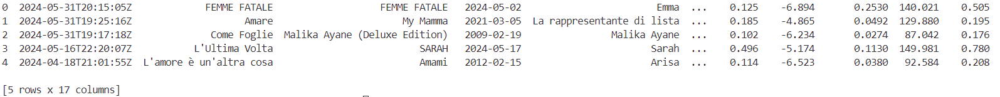
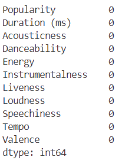
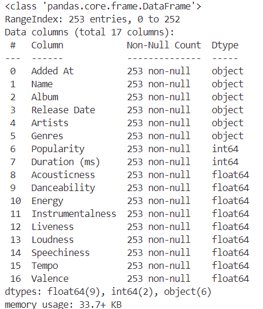
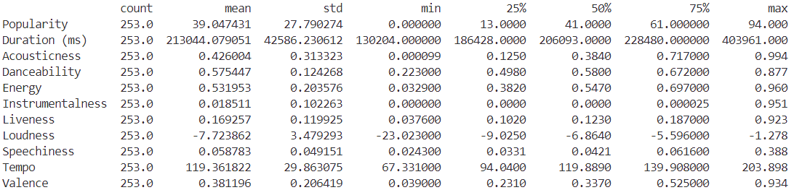
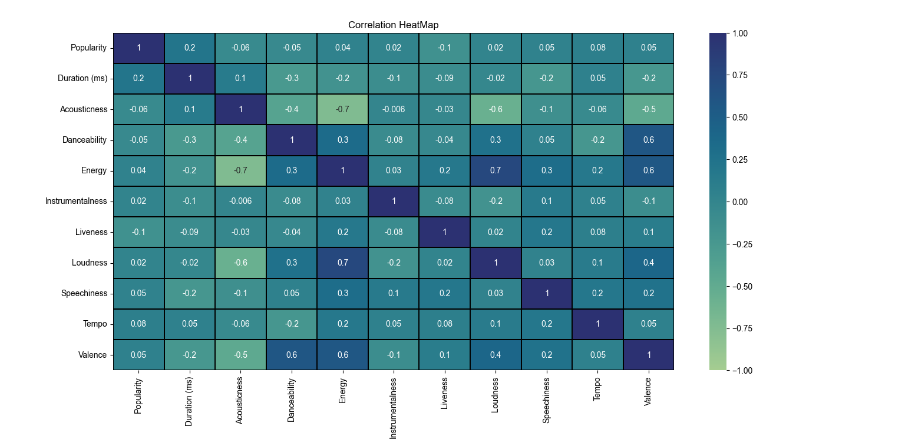

<h1>Spotify Music Data Analysis Project🎧</h1>
<h2>Introduction</h2>
<p>
	The Spotify Data Analysis Python Project delves into the world of music data
	analysis using Python, showcasing the powerful capabilities of data-driven
	insights in understanding trends, patterns, and correlations within music
	datasets. All data was collected directly from the Spotify API, underscoring
	the authenticity and reliability of the dataset used for analysis. In today's
	digital age, data analysis plays a pivotal role in various domains, including
	music streaming services like Spotify. This project serves as an exploration
	into the realm of data science, specifically focusing on extracting meaningful
	insights from Spotify's extensive dataset.<br/> Feel free to reach out! 
	<a href="https://www.linkedin.com/in/cristinagenduso"
		>Linkedln | Cristina Genduso</a
	>
</p>

Tools Used🛠️:

<ul>
	<li>Programming Language: Python<br /></li>
	<li>Libraries: Pandas, Numpy, Matplotlib, Seaborn<br /></li>
	<li>IDE: Jupyter Notebook<br /></li>
	<li>Dataset: Personal Spotify Dataset</li>
</ul>

<h2>Import Required Libraries</h2>

```python
import numpy as np
import pandas as pd
import matplotlib.pyplot as plt
import seaborn as sns
```

<ul>
	<li>
		<code>import numpy as np</code>: This imports the NumPy library and aliases
		it as 'np'. NumPy is used for numerical computations and provides support
		for arrays and matrices.
	</li>
	<li>
		<code>import pandas as pd</code>: This imports the Pandas library and
		aliases it as 'pd'. Pandas is used for data manipulation and analysis,
		providing data structures like DataFrames for tabular data.
	</li>
	<li>
		<code>import matplotlib.pyplot as plt</code>: This imports the Pyplot module
		from the Matplotlib library and aliases it as 'plt'. Matplotlib is a popular
		plotting library in Python, and Pyplot provides a convenient interface to
		create visualizations.
	</li>
	<li>
		<code>import seaborn as sns</code>: This imports the Seaborn library and
		aliases it as 'sns'. Seaborn is built on top of Matplotlib and offers a
		higher-level interface for creating attractive statistical visualizations.
	</li>
</ul>

<h2>Exploring the Dataset</h2>

<h3>Data Collection</h3>
<p>
	The dataset used in this project was meticulously collected directly from the
	Spotify API, comprising a comprehensive collection of personal liked songs.
	Leveraging the capabilities of the Spotify API, I gathered a diverse range of
	music tracks, reflecting my musical preferences and tastes. This hands-on
	approach ensured the authenticity and relevance of the dataset, as it consists
	entirely of songs that resonate with me personally.
</p>

```python
tracks = pd.read_csv('./inputs/saved_tracks_with_audio_features.csv')
```

<h3>Overview</h3>
<p>
	The dataset provides a detailed glimpse into my music library, encompassing
	various audio features, artist information, genre classifications, and
	temporal attributes of each track. With this rich dataset at hand, the
	exploration aims to uncover intriguing patterns, correlations, and insights
	hidden within the vast realm of my favorite songs on Spotify. Let's delve
	deeper into the dataset to uncover fascinating insights and trends that
	illuminate my musical journey.
</p>

```python
tracks.head()
```

<p>
	NOTE: The image provided is not the entirety of the complete image, as there
	are restrictions in capturing full images through screenshots. To access the
	comprehensive table, please refer to the Jupyter notebook folder within this
	repository.
</p>
<h4>Output:</h4>


<p>
	This line of code calls the <code>head()</code> method on the 'tracks'
	DataFrame. This method is used to display the first few (5 by default) rows of
	the DataFrame. This is useful for quickly getting an overview of the data.
</p>

<h3>Identifying Null Values in the Dataset</h3>

```python
#checking null in tracks data
pd.isnull(tracks).sum()
```

<h4>Output:</h4>

<p>This line of code uses the <code>pd.isnull()</code> function on the 'tracks'
DataFrame to create a new boolean DataFrame where each cell contains:
<ul>
	<li>
		<code>True</code> if the corresponding cell in the original DataFrame
		('tracks') is null;
	</li>
	<li><code>False</code> otherwise.</li>
</ul>
The <code>.sum()</code> function is then used to count the number of
<code>True</code> values in each column, effectively giving the count of missing
values in each column.</p>

<h3>Dataset Info</h3>

```python
#checking info in tracks data
tracks.info()
```

<h4>Output:</h4>

<p>
	This line of code calls the <code>info()</code> method on the 'tracks'
	DataFrame. The <code>info()</code> method provides a concise summary of the
	DataFrame, including the data types of each column, the number of non-null
	values, and memory usage.
</p>

---

<h2>Extracting Insights from the Dataset through Analysis</h2>
<ol>
	<li>Discovering the Top 10 Popular Songs in the Spotify Dataset</li>

```python
most = tracks.sort_values(by='Popularity', ascending=False).head(10)
```

<h4>Output:</h4>
    
    <p>
    	This line of code creates sorts the <code>'tracks'</code> DataFrame based on the 'popularity' column in ascending order. The <code>head(10)</code> notation selects the first 10 rows of the sorted
    	DataFrame, effectively selecting the 10 most popular tracks.
    </p>
    <br />

  <li>Descriptive Statistics</li>

```python
# Display summary statistics of the numerical columns in the dataset
tracks.describe().transpose()
```

  <h4>Output:</h4>
  
  <p>
    This line of code generates a concise summary of the numerical features in
    the tracks DataFrame, providing insights into the central tendency,
    dispersion, and distribution of the data across different attributes
  </p>
  <br />
  <li>Average popularity of the tracks</li>

```python
average_popularity = tracks['Popularity'].mean()
```

  <h4>Output:</h4>
  
  <p>
    This line of code calculates the average popularity of all the tracks in the
    <code>tracks</code> DataFrame and stores this value in the variable
    <code>average_popularity</code>.
  </p>
  <br />

  <li>Visualization: Pearson Correlation Heatmap for Two Variables</li>

```python
numeric_columns = tracks.select_dtypes(include=['float64',
'int64']).columns td = tracks[numeric_columns].corr(method = 'pearson') hmap =
sns.heatmap(td, annot = True, fmt = '.1g', vmin=-1, vmax=1, center=0,
cmap='crest', linewidths=0.1, linecolor='black')
```

  <h4>Output:</h4>
  
  <ul>
    <li>
      <code
        >numeric_columns = tracks.select_dtypes(include=['float64',
        'int64']).columns</code
      >: This line of code select the columns from the
      <code>tracks</code> DataFrame that have numeric data types (<code
        >'float64', 'int64'</code
      >).
    </li>
    <li>
      <code
        >hmap = sns.heatmap(td, annot=True, fmt='.1g', vmin=-1, vmax=1,
        center=0, cmap='crest', linewidths=0.1, linecolor='black')</code
      >: This line of code uses Seaborn's <code>heatmap()</code> function to
      create a heatmap visualization of the correlation matrix. It displays the
      correlation values as annotations, uses a color map ('crest') to represent
      the correlation strength, and sets the range of correlation values to be
      between -1 and 1.
    </li>
  </ul>
  <br />

  <li>Regression Plot of Popularity vs. Acousticness with Regression Line</li>

```python
sns.set_style('darkgrid') plt.figure(figsize=(10, 6))
sns.regplot(data=tracks, x='Acousticness', y='Popularity',
color='orange').set(title='Popularity vs Acousticness Correlation') plt.show()
```

  <h4>Output:</h4>
  
  <ul>
    <li>
      <code
        >sns.regplot(data=tracks, x='Acousticness', y='Popularity',
        color='orange')</code
      >: This line of code uses Seaborn's <code>regplot()</code> function to
      create a regression plot. It visualizes the relationship between the
      'popularity' and 'acousticness' columns from the
      <code>tracks</code> DataFrame.
    </li>
    <li>
      <code>.set(title='Popularity vs Acousticness Correlation')</code>: This
      line of code sets the title for the regression plot.
    </li>
  </ul>
  <br />

  <li>Top 5 Genres the Spotify Dataset</li>

```python
popular = genre_counts.sort_values(ascending=False).head(5)
sns.barplot(y=popular.index, x=popular.values, palette='viridis',
legend=False).set(title='Top 5 Genres by Frequency')
```

  <h4>Output:</h4>
  
  <ul>
    <li>
      <code>popular = genre_counts.sort_values(ascending=False).head(5)</code>:
      This line of code extracts the 5 most popular genres in the dataset.
    </li>
    <li>
      <code
        >sns.barplot(y=popular.index, x=popular.values, palette='viridis',
        legend=False)</code
      >: This line of code uses Seaborn's <code>barplot()</code> function to
      create a bar plot.
    </li>
    <li>
      <code>.set(title='Top 5 Genres by Frequency')</code>: This line of code
      sets the title for the regression plot.
    </li>
  </ul>
  <br />

  <li>Monthly additions of favorite tracks</li>

```python
monthly_additions = tracks['Month'].value_counts().reindex(['Jan',
'Feb', 'Mar', 'Apr', 'May', 'Jun', 'Jul', 'Aug', 'Sep', 'Oct', 'Nov', 'Dec'])
sns.barplot(x=monthly_additions.index, y=monthly_additions.values,
palette='flare')
```

  <h4>Output:</h4>
  
  <ul>
    <li>
      <code
        >monthly_additions = tracks['Month'].value_counts().reindex(['Jan',
        'Feb', 'Mar', 'Apr', 'May', 'Jun', 'Jul', 'Aug', 'Sep', 'Oct', 'Nov',
        'Dec'])</code
      >: This line of code reindexes the <code>Month</code> columns, into the
      name of the corresponding month.
    </li>
    <li>
      <code
        >sns.barplot(x=monthly_additions.index, y=monthly_additions.values,
        palette='flare')</code
      >: This line of code uses Seaborn's <code>barplot()</code> function to
      create a bar plot.
    </li>
  </ul>
  <br />

  <li>Days with Peaks of Indie Tracks</li>

```python
daily_indie_additions = indie_tracks['Added
At'].dt.date.value_counts().sort_index()
sns.lineplot(x=daily_indie_additions.index, y=daily_indie_additions.values,
marker='o', color='purple')
```

  <h4>Output:</h4>
  
  <br />

  <li>Top 5 indie artists in the dataset</li>

```python
indie_artists =
indie_tracks['Artists'].str.split(',').explode().value_counts().head(5)
sns.barplot(y=indie_artists.index, x=indie_artists.values,
palette='cubehelix')
```

  <h4>Output:</h4>
  
</ol>
